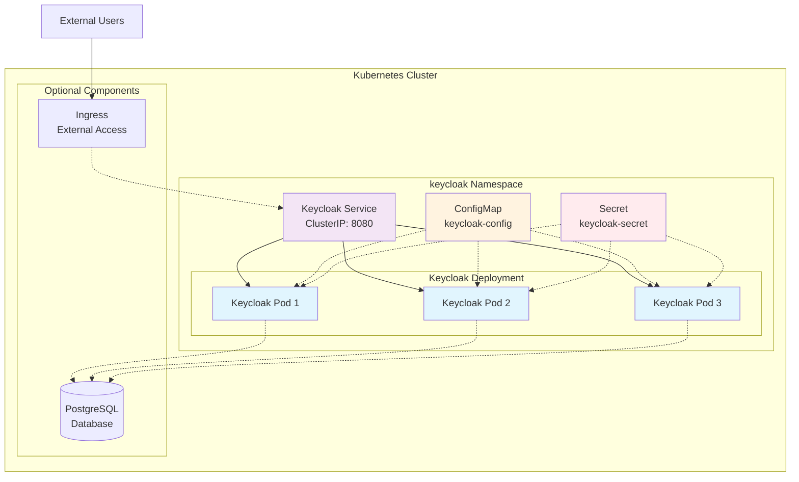

# Keycloak Kubernetes Deployment

A comprehensive Kubernetes deployment configuration for running Keycloak Identity and Access Management with high availability (3 replicas) in a dedicated namespace.

## 📋 Table of Contents

- [Overview](#overview)
- [Architecture](#architecture)
- [Prerequisites](#prerequisites)
- [Quick Start](#quick-start)
- [Configuration](#configuration)
- [Deployment](#deployment)
- [Access & Usage](#access--usage)
- [Monitoring & Health Checks](#monitoring--health-checks)
- [Troubleshooting](#troubleshooting)
- [Production Considerations](#production-considerations)

## 🌐 Overview

This project provides a production-ready Keycloak deployment on Kubernetes with the following features:

- **High Availability**: 3 pod replicas with load balancing
- **Dedicated Namespace**: Isolated `keycloak` namespace
- **Security**: Non-root containers with proper security contexts
- **Health Monitoring**: Readiness and liveness probes
- **Resource Management**: CPU and memory limits
- **Scalable**: Easy to scale up/down as needed

## 🏗️ Architecture



## Component Overview

| Component | Type | Purpose |
|-----------|------|---------|
| **Namespace** | Namespace | Isolates Keycloak resources |
| **Deployment** | Apps/v1 | Manages 3 Keycloak pod replicas |
| **Service** | ClusterIP | Load balances traffic to pods |
| **ConfigMap** | Configuration | Non-sensitive environment variables |
| **Secret** | Credentials | Sensitive data (passwords, tokens) |
| **Ingress** | Optional | External access routing |
| **PostgreSQL** | Optional | External database for persistence |

## ✅ Prerequisites

Before deploying, ensure you have:

- **Kubernetes Cluster**: v1.20+ (minikube, kind, EKS, GKE, AKS)
- **kubectl**: Configured to access your cluster
- **Resources**: At least 2GB RAM and 1 CPU available
- **Storage**: PersistentVolume support (for database if used)

### Verify Prerequisites

```bash
# Check Kubernetes version
kubectl version --short

# Check available resources
kubectl top nodes

# Verify cluster access
kubectl cluster-info
```

## 🚀 Quick Start

### 1. Clone and Navigate

```bash
git clone <your-repo>
cd keyclock
```

### 2. Deploy Keycloak

```bash
# Deploy all components
kubectl apply -f deploy-keyclock.yaml

# Verify deployment
kubectl get all -n keycloak
```

### 3. Wait for Pods to be Ready

```bash
# Watch pod status
kubectl get pods -n keycloak -w

# Check deployment status
kubectl rollout status deployment/keycloak -n keycloak
```

### 4. Access Keycloak

```bash
# Port forward to access locally
kubectl port-forward -n keycloak svc/keycloak-service 8080:8080

# Access via browser
open http://localhost:8080
```

## ⚙️ Configuration

### Environment Variables

| Variable | Source | Default | Description |
|----------|--------|---------|-------------|
| `KC_DB` | ConfigMap | `postgres` | Database type |
| `KC_DB_URL` | ConfigMap | `jdbc:postgresql://...` | Database connection URL |
| `KC_DB_USERNAME` | Secret | `keycloak` | Database username |
| `KC_DB_PASSWORD` | Secret | `password` | Database password |
| `KEYCLOAK_ADMIN` | Secret | `admin` | Admin username |
| `KEYCLOAK_ADMIN_PASSWORD` | Secret | `admin123` | Admin password |
| `KC_HOSTNAME_STRICT` | ConfigMap | `false` | Strict hostname checking |
| `KC_HTTP_ENABLED` | ConfigMap | `true` | Enable HTTP (dev mode) |

### Updating Credentials

```bash
# Update admin password (base64 encoded)
echo -n "new-admin-password" | base64
kubectl patch secret keycloak-secret -n keycloak -p '{"data":{"KEYCLOAK_ADMIN_PASSWORD":"bmV3LWFkbWluLXBhc3N3b3Jk"}}'

# Restart deployment to apply changes
kubectl rollout restart deployment/keycloak -n keycloak
```

### Scaling

```bash
# Scale to 5 replicas
kubectl scale deployment keycloak -n keycloak --replicas=5

# Scale back to 3 replicas
kubectl scale deployment keycloak -n keycloak --replicas=3
```

## 📦 Deployment

### Step-by-Step Deployment

1. **Create Namespace**
   ```bash
   kubectl create namespace keycloak
   ```

2. **Deploy Configuration**
   ```bash
   kubectl apply -f deploy-keyclock.yaml
   ```

3. **Verify Resources**
   ```bash
   kubectl get all,cm,secret -n keycloak
   ```

### Deployment Status Check

```bash
# Check all resources
kubectl get all -n keycloak

# Check pod logs
kubectl logs -n keycloak -l app=keycloak --tail=50

# Check events
kubectl get events -n keycloak --sort-by='.lastTimestamp'
```

## 🔐 Access & Usage

### Local Access (Development)

```bash
# Port forward
kubectl port-forward -n keycloak svc/keycloak-service 8080:8080

# Access admin console
open http://localhost:8080/admin/
```

**Default Credentials:**
- Username: `admin`
- Password: `admin123`

### External Access (Production)

Uncomment the Ingress section in `deploy-keyclock.yaml`:

```yaml
apiVersion: networking.k8s.io/v1
kind: Ingress
metadata:
  name: keycloak-ingress
  namespace: keycloak
  annotations:
    kubernetes.io/ingress.class: "nginx"
    cert-manager.io/cluster-issuer: "letsencrypt-prod"  # For TLS
spec:
  tls:
  - hosts:
    - keycloak.yourdomain.com
    secretName: keycloak-tls
  rules:
  - host: keycloak.yourdomain.com
    http:
      paths:
      - path: /
        pathType: Prefix
        backend:
          service:
            name: keycloak-service
            port:
              number: 8080
```

### API Access

```bash
# Get admin token
TOKEN=$(curl -X POST \
  'http://localhost:8080/realms/master/protocol/openid-connect/token' \
  -H 'Content-Type: application/x-www-form-urlencoded' \
  -d 'username=admin' \
  -d 'password=admin123' \
  -d 'grant_type=password' \
  -d 'client_id=admin-cli' | jq -r '.access_token')

# List realms
curl -H "Authorization: Bearer $TOKEN" \
  'http://localhost:8080/admin/realms'
```

## 📊 Monitoring & Health Checks

### Health Endpoints

| Endpoint | Purpose | Port |
|----------|---------|------|
| `/health/live` | Liveness probe | 8080 |
| `/health/ready` | Readiness probe | 8080 |
| `/realms/master` | Application health | 8080 |

### Monitoring Commands

```bash
# Check pod health
kubectl get pods -n keycloak -o wide

# View resource usage
kubectl top pods -n keycloak

# Check service endpoints
kubectl get endpoints -n keycloak

# Monitor logs in real-time
kubectl logs -n keycloak -l app=keycloak -f
```

### Metrics (if enabled)

```bash
# Access metrics endpoint
kubectl port-forward -n keycloak svc/keycloak-service 8080:8080
curl http://localhost:8080/metrics
```

## 🔧 Troubleshooting

### Common Issues

#### 1. Pods Not Starting

```bash
# Check pod status and events
kubectl describe pod -n keycloak -l app=keycloak

# Check resource limits
kubectl top nodes
kubectl top pods -n keycloak
```

#### 2. Database Connection Issues

```bash
# Check database connectivity (if using external DB)
kubectl exec -n keycloak deployment/keycloak -- nslookup postgres-service

# Verify database credentials
kubectl get secret keycloak-secret -n keycloak -o yaml
```

#### 3. Service Access Issues

```bash
# Check service and endpoints
kubectl get svc,ep -n keycloak

# Test internal connectivity
kubectl run test-pod --rm -i --tty --image=busybox -- /bin/sh
nslookup keycloak-service.keycloak.svc.cluster.local
```

### Debug Commands

```bash
# Get detailed pod information
kubectl describe pod -n keycloak <pod-name>

# Access pod shell
kubectl exec -it -n keycloak <pod-name> -- /bin/bash

# Check container logs
kubectl logs -n keycloak <pod-name> -c keycloak

# Port forward for debugging
kubectl port-forward -n keycloak pod/<pod-name> 8080:8080
```

### Log Analysis

```bash
# View startup logs
kubectl logs -n keycloak -l app=keycloak --since=10m

# Search for errors
kubectl logs -n keycloak -l app=keycloak | grep -i error

# Export logs for analysis
kubectl logs -n keycloak -l app=keycloak > keycloak-logs.txt
```

## 🏭 Production Considerations

### Security Hardening

1. **Change Default Passwords**
   ```bash
   # Generate strong password
   openssl rand -base64 32

   # Update secret
   kubectl create secret generic keycloak-secret \
     --from-literal=KEYCLOAK_ADMIN_PASSWORD=$(openssl rand -base64 32) \
     --dry-run=client -o yaml | kubectl apply -f -
   ```

2. **Use Production Mode**
   - Replace `start-dev` with `start` in deployment
   - Configure proper hostname and TLS
   - Set up external database

3. **Network Policies**
   ```yaml
   apiVersion: networking.k8s.io/v1
   kind: NetworkPolicy
   metadata:
     name: keycloak-netpol
     namespace: keycloak
   spec:
     podSelector:
       matchLabels:
         app: keycloak
     policyTypes:
     - Ingress
     ingress:
     - from:
       - namespaceSelector: {}
       ports:
       - protocol: TCP
         port: 8080
   ```

### Database Setup

For production, use an external PostgreSQL database:

```yaml
# Update ConfigMap
apiVersion: v1
kind: ConfigMap
metadata:
  name: keycloak-config
  namespace: keycloak
data:
  KC_DB_URL: "jdbc:postgresql://your-db-host:5432/keycloak"
```

### TLS Configuration

```yaml
# Add TLS to Ingress
spec:
  tls:
  - hosts:
    - keycloak.yourdomain.com
    secretName: keycloak-tls-cert
```

### Backup Strategy

```bash
# Backup Keycloak configuration
kubectl exec -n keycloak deployment/keycloak -- \
  /opt/keycloak/bin/kc.sh export --file /tmp/keycloak-backup.json

# Copy backup from pod
kubectl cp keycloak/<pod-name>:/tmp/keycloak-backup.json ./keycloak-backup.json
```

## 📈 Scaling & Performance

### Horizontal Scaling

```bash
# Scale up during peak hours
kubectl scale deployment keycloak -n keycloak --replicas=5

# Scale down during off-peak
kubectl scale deployment keycloak -n keycloak --replicas=2
```

### Resource Optimization

```yaml
# Adjust resources based on load
resources:
  requests:
    memory: "1Gi"
    cpu: "500m"
  limits:
    memory: "2Gi"
    cpu: "1000m"
```

### Performance Monitoring

```bash
# Monitor resource usage
kubectl top pods -n keycloak --containers

# Check response times
curl -w "@curl-format.txt" -o /dev/null -s http://localhost:8080/health
```

---

## 📞 Support

For issues and questions:

1. Check the [troubleshooting section](#troubleshooting)
2. Review Kubernetes and Keycloak logs
3. Consult [Keycloak Documentation](https://www.keycloak.org/documentation)
4. Check [Kubernetes Documentation](https://kubernetes.io/docs/)

## 📄 License

This project is licensed under the MIT License - see the [LICENSE](LICENSE) file for details.